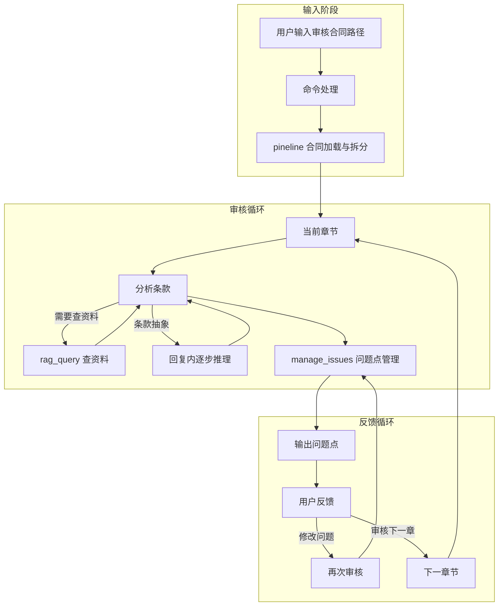

# 合同审核智能体 - 架构图（与实现一致）

本图根据当前代码实现修正：输入阶段为命令 + pineline（非 LLM 工具），审核循环中 CoT 为回复内推理、无独立工具。

## 架构概览



## 与实现的对应关系

| 环节 | 图中名称 | 实现位置 |
|------|----------|----------|
| 输入 | 命令处理 + pineline 合同加载与拆分 | `ui/commands.py` 识别「审核合同 <路径>」→ 调用 `pineline.contract_loader.load_and_split_contract`，写入 `ReviewState` |
| 审核 | rag_query | `tools/contract_tools.py` 中 `RagQueryTool` |
| 审核 | 回复内逐步推理 | 系统提示要求 LLM 在回复中直接进行 CoT，无独立工具 |
| 审核 | manage_issues | `tools/contract_tools.py` 中 `ManageIssuesTool`（get_current_section / add / next_section 等） |
| 反馈 | 用户反馈 → 再审核 / 下一章 | 用户输入经 `handle_command` 或再次进入 Agent，由 Agent 或命令推进章节 |

## 说明

- **合同加载与拆分**：由用户命令「审核合同 <路径>」触发，不经过 LLM，也不存在名为 `split_contract` 的工具。
- **chain_of_thought**：未实现为独立工具，CoT 在 LLM 的自然语言回复中完成。

---

## 实现梳理（Code Review 用）

### 1. 主循环与入口

- **入口**：[src/app.py](src/app.py) 主循环 `while True` 中：
  - 先 `handle_command(user_input, agent)` 判断是否为命令；
  - 若 `handled=True` 则只执行命令（如加载合同、退出、status、export、自动审核等），不调用 Agent；
  - 若 `handled=False` 则把用户输入交给 `run_agent(user_input)`，即 `agent.run(user_input, context=...)`。
- **命令与 Agent 的边界**：所有「审核合同、quit、status、export、reset、help、自动审核」都在 [src/ui/commands.py](src/ui/commands.py) 的 `handle_command` 里处理；其余自然语言（如「请审核当前章节」「下一章」）才进入 Agent。

### 2. 输入阶段：合同加载与拆分（非 LLM 工具）

- **触发**：用户输入以「审核合同」开头时，`handle_command` 解析出路径，调用 `load_and_split_contract(agent.state, path)`。
- **实现**：[src/pineline/contract_loader.py](src/pineline/contract_loader.py) 中 `load_and_split_contract(state, path)`：
  - 读取文件（docx/txt/md），`_read_file` → `_read_docx` 或纯文本；
  - 用 `_split_sections(content)` 按正则拆章（第 X 条/章、附件等），得到 `(title, content)` 列表；
  - 调用 `state.reset()` 后写入 `state.contract_name`、`state.contract_path`，并对每个章节 `state.add_section(title, content)`；
  - 返回给用户的成功信息在 commands 里直接打印，不经过 LLM。
- **状态载体**：[src/state/review_state.py](src/state/review_state.py) 的 `ReviewState` 持有 `sections`、`current_section_index`、`issues` 等，整条链路（commands、agent、tools）共用同一个 `agent.state` 引用。

### 3. 审核循环：Agent + 工具

- **单次审核触发**：用户输入「请审核当前章节」或自动审核里 `run_agent("请审核当前章节，识别所有潜在问题点")` 时，调用 `ContractReviewAgent.run(input, context=...)`。
- **run 流程**：[src/agents/contract_review_agent.py](src/agents/contract_review_agent.py) 的 `run()`：
  - `_build_messages(input, context)` → 内含 `_build_system_prompt()` 构建系统提示；
  - 系统提示中**固定加载当前问题列表**：若 `self._state.issues` 非空，则按章节拼出「已有问题点（供参考与修正）」写入系统提示（每审核一个 section 时加载一次，不随同轮对话变更）；
  - 循环：`_call_llm_*` 得到 response → 若有 tool_calls 则 `_execute_tool_calls`，把工具结果追加到 messages，再继续下一轮 LLM，直到 LLM 不再调工具、返回最终回复。
- **工具注册**：`create_contract_tools(self._state)` 在 [src/tools/contract_tools.py](src/tools/contract_tools.py) 中，只注册两个工具：
  - **ManageIssuesTool(state)**：`get_current_section`（当前章节+当前章已有问题）、`next_section`/`prev_section`、`add`/`update`/`delete`/`list`、`confirm`/`reject`、`export`；
  - **RagQueryTool()**：调用 LlamaCloud 做知识库检索。
- **CoT**：无独立 chain_of_thought 工具；系统提示要求对复杂条款「在回复中直接进行逐步推理」，由 LLM 自然语言完成。

### 4. 问题点参考与修正

- **参考**：每次 `run()` 开始时，`_build_system_prompt()` 会从 `self._state` 读取当前全部 `issues`，按 `sections` 分组，写入系统提示的「已有问题点（供参考与修正）」；智能体在本轮审核中看到的是**该次 run 开始时的快照**。
- **修正**：系统提示中说明若认为某条已有问题有误，可使用 `manage_issues` 的 `update` 或 `delete`；实际执行在 `ManageIssuesTool.execute` 中调用 `state.update_issue(issue_id, ...)` / `state.delete_issue(issue_id)`。

### 5. 反馈循环：下一章 / 再审核

- **下一章**：用户说「下一章」时，若未命中命令则进入 Agent；Agent 通过调用 `manage_issues(operation="next_section")` 使 `state.current_section_index += 1`，并在回复中提示用户；自动审核时则由主循环在每章审核后主动调用 `run_agent("下一章")`。
- **再审核 / 修改问题**：用户自然语言要求修改某条问题或再审核时，同样进入 `run_agent(user_input)`；Agent 可调用 `manage_issues` 的 `update`/`delete`/`reject` 等，或再次分析当前章节。

### 6. 数据流小结

```text
用户输入
  → handle_command
      → 若是「审核合同 <路径>」：load_and_split_contract(agent.state, path) → 写 state.sections，不经过 LLM
      → 若是 status/export/reset/help/quit/自动审核：直接处理，不调用 Agent
      → 否则：不处理，交给 run_agent
  → run_agent(user_input) → agent.run(user_input, context)
      → _build_messages → _build_system_prompt（含当前 state 下的「已有问题点」快照）
      → LLM 循环：可调用 manage_issues（get_current_section / add / update / delete / next_section 等）、rag_query
      → 工具调用写回 agent.state（issues、current_section_index）
      → 返回最终回复给用户
```

按上述顺序在 Code Review 中讲：主循环与命令边界 → 输入阶段 pineline 写 state → 审核循环 Agent+工具+问题点快照 → 反馈（下一章/再审核）→ 数据流小结，即可把「最新架构是怎么实现的」说清楚。
